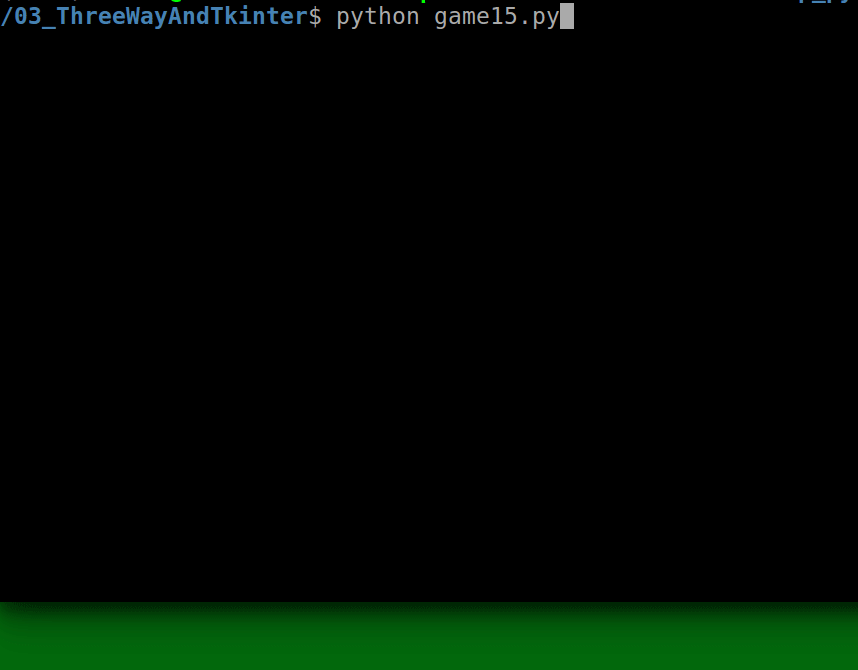

### Game 15
Run the game via the following:
```
python game15.py
```

#### Demo:
If you are interested, enjoy the walkthrough of the game (~2.5 minutes):



#### Notes:
- Unwinnable cases are avoided according to the following rule:
    (assume `dr` = disorder rate (count of cases when a plate with lower number succeeds a plate with the greater one), `ir` = index of a row where the blank plate is (index starts with 1))

    game is winnable iff (`dr` + `ir`) % 2 == 0
