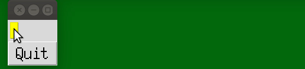

### tk.Entry imitation widget
Run via the following:
```
python LabelEdit.py
```

#### Demo:
If you are interested, enjoy the demonstration:



#### Notes:
The widget is a simple one-line VIMish editor:

- two modes: INSERT for input and COMMAND for ..., actually just for demonstration purposes and for switching bach to INSERT via `a` or `i` button
- `Home`, `End`, left and right arrows, `BackSpace`, `Delete` are supported and provide expected action, but text editing is only supported in INSERT mode
- Cyrillic symbols are not supported (you can try, but you won't like it)
